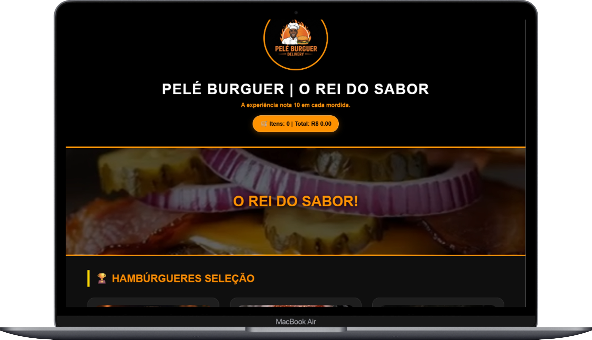
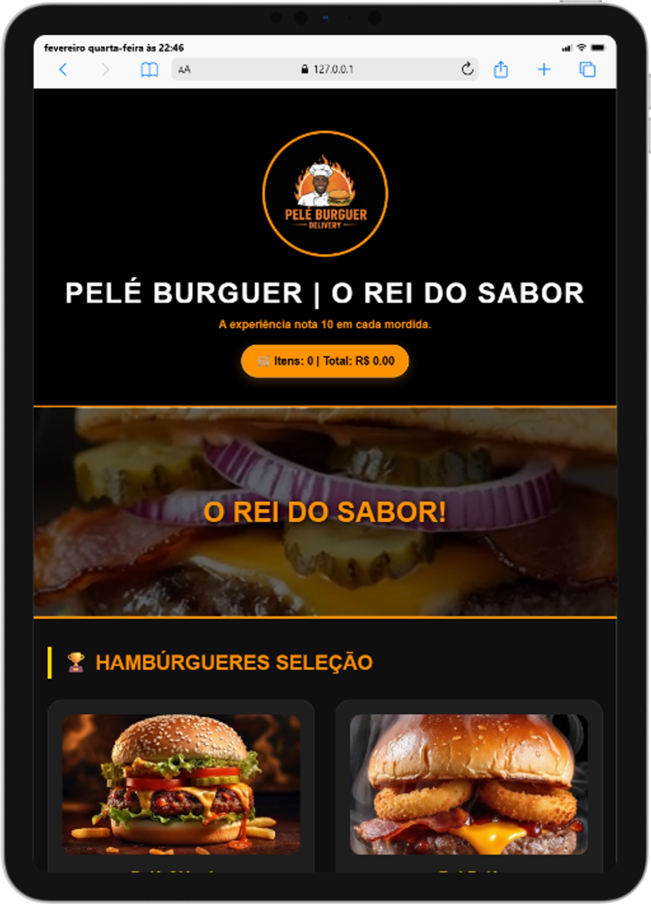
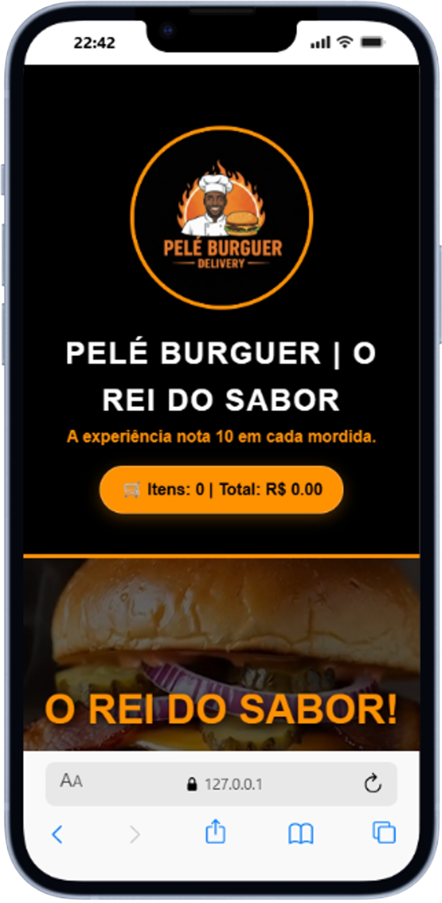

# 🌐 Pelé Burguer - Delivery 🍔

Sistema de cardápio digital e gestão de pedidos via WhatsApp, desenvolvido para oferecer uma experiência rápida e intuitiva ao cliente.

> 🔗 **Acesse o projeto online:** [Clique aqui para abrir o site](https://marcos-devclub2024.github.io/Pele-Burguer-delivery/)

## 🚀 Funcionalidades

* **🛒 Cardápio Interativo**: Adição de itens com ajuste de quantidade (+ / -).
* **🚛 Cálculo de Frete**: Sistema inteligente que soma a taxa de entrega baseada no bairro selecionado.
* **💧 Carrinho Dinâmico**: Atualização de valores em tempo real e limpeza automática após o pedido.
* **📲 Integração WhatsApp**: Envio de resumo detalhado do pedido diretamente para o estabelecimento.
* **📱 Design Responsivo**: Totalmente adaptado para dispositivos móveis.

---

## 🛠️ Tecnologias

---

## 👨‍💻 Sobre o Projeto

*Desenvolvido por **Marcos Vitalicia** durante a jornada no **DevClub**.*

---

## 📱 Interface Responsiva (com Fundo)

Abaixo, você pode conferir como o **Pelé Burguer** se adapta perfeitamente em diferentes dispositivos. As imagens foram colocadas em uma moldura para garantir melhor visualização:

| Versão Desktop (MacBook) | Versão Tablet & Mobile (iPad + iPhone) |
| :---: | :---: |
  |      |git add README.md