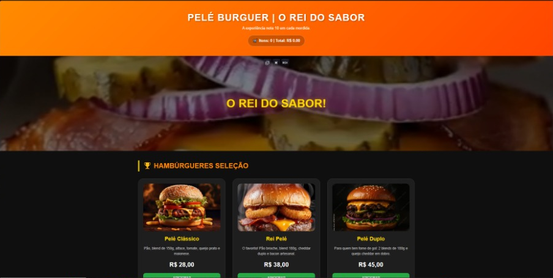
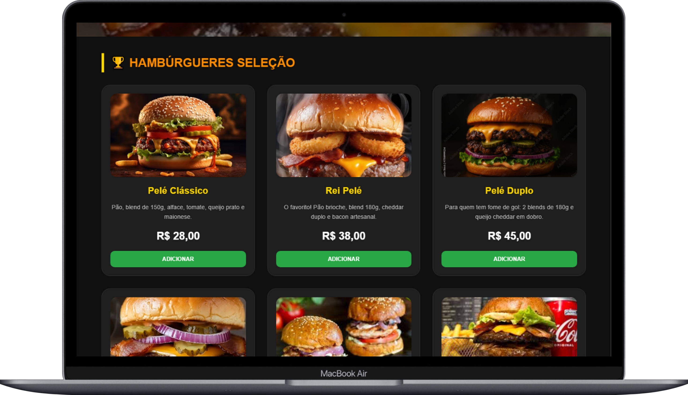
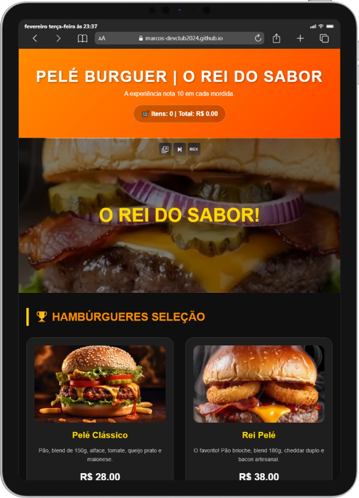
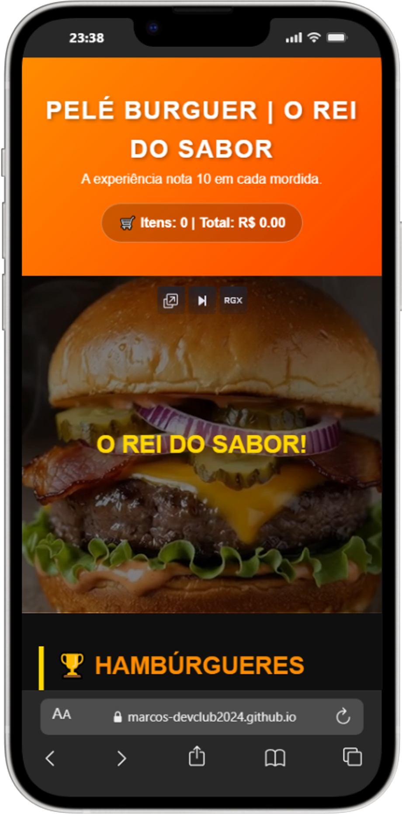

# ⚽ Pelé Burguer - Delivery 🍔

Sistema de cardápio digital e gestão de pedidos via WhatsApp, desenvolvido para oferecer uma experiência rápida e intuitiva ao cliente.

## 🚀 Funcionalidades
- **Cardápio Interativo:** Adição de itens com ajuste de quantidade (+ / -).
- **Cálculo de Frete:** Sistema inteligente que soma a taxa de entrega baseada no bairro selecionado.
- **Carrinho Dinâmico:** Atualização de valores em tempo real e limpeza automática após o pedido.
- **Integração WhatsApp:** Envio de resumo detalhado do pedido diretamente para o estabelecimento.
- **Design Responsivo:** Totalmente adaptado para dispositivos móveis.

## 🛠️ Tecnologias
- **HTML5** & **CSS3** (Layout Moderno)
- **JavaScript ES6+** (Lógica do Carrinho e Integração)

---
*Projeto desenvolvido por Marcos Silva durante a jornada DevClub.*

  

  

  

  

